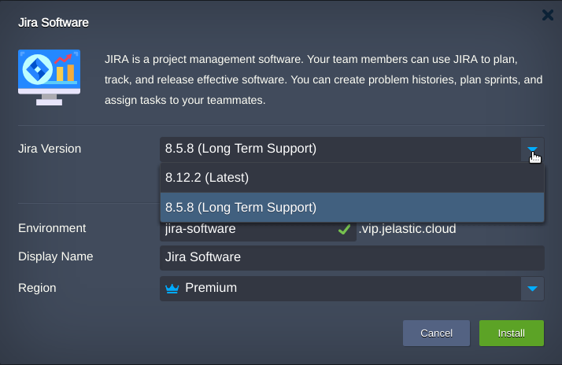
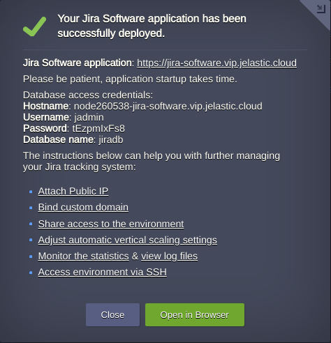
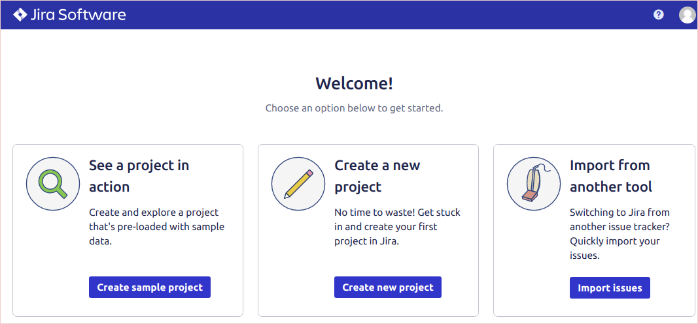

# Jira Software

JIRA Software is the perfect tool for planning, managing, tracking, and reviewing your team's performance during the entire software development process. This solution is most widely used among developers, in the form of a bug-tracking system. Universal portal for developers.

## Installation

Get your Jelastic account at any of available [hosting provider](https://jelastic.cloud/).

Click the **DEPLOY TO JELASTIC** button, specify your email address within the widget and press **Install**.

<a href="https://jelastic.com/install-application/?manifest=https://raw.githubusercontent.com/vlobzakov/jira/master/manifest.yaml">

</a>  
      
> **Note:** If you are already registered at Jelastic, you can deploy this cluster by importing the  [package manifest raw link](https://raw.githubusercontent.com/vlobzakov/jira/master/manifest.yaml).  

If required change **Environment** Name and Destination **Region**.

Once the installation is completed you may proceed to the initial setup **URL** of your Chat System by pressing **Open in Browser** button in a successful installation window.  

Right after setup is finished, start using Jira tracking system.

